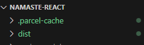
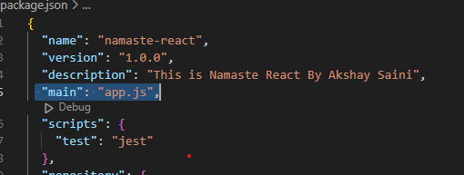

# React
- Most popular javascript library
- used to build large-scale front-end application
- Two ways available to incorporate react in project
  
## 1st - CDN Links in react
- network of servers distributed geographically to deliver content to users more efficiently.
- for react it is a place where we have react libraries hosted and we are pulling these into our project

## Benefits of Using a CDN:
- Faster Load Times: By delivering content from a server closest to the user, CDNs reduce latency and improve load times.
- Reduced Server Load: Offloading traffic to a CDN reduces the burden on your primary server, enhancing performance.
- Reliability: CDNs offer redundancy, ensuring content availability even if one server goes down.
- Scalability: Easily handle high traffic volumes without affecting performance.

## Steps to add React using CDN links
- Go to https://legacy.reactjs.org/docs/cdn-links.html
- Above will have 2 versions of React and ReactDOM CDN links available
    - Development
    - Productoon
- Copy the development links and add the same in startup file of project
```js
 <script crossorigin src="https://unpkg.com/react@18/umd/react.development.js"></script>
 <script crossorigin src="https://unpkg.com/react-dom@18/umd/react-dom.development.js"></script>
```

## 2nd - Using npm (npmjs.com)
- package manager which is collection of libraries.
- standard repository for all the packages.
- all package(libraries, utilities) are hosted here.
- NPM manages these packages

## Steps to include npm in project
- Run command "npm init" on teminal
- Specify the required details it is asking for.
- As a reult we will get "package.json" (configuartion for npm)

## React and ReactDOM
- React not only works on browsers but also on mobiles (react native) etc devices also. That is why wehave 2 files
    - React -> consists of core react functionality
    - React-Dom -> bridge between react and browser. It is having react operations thats can modify document.

## React Element
- similar to DOM element but not the DOM Element. 
- React element is basically an object.
- when we render react element on DOM, then it becomes DOM element/HTML Element that we see on web page.

## How to create react element in traditional way
```js
React.createElement("h1",{id: "heading"}, "This is heading tag")
```
- createElement will take 3 parameters
  - tag/element that needs to be created
  - object that can have additional tag properties/attributes.
  - Child of tag which can be either a plain string or can be another react element.

## Rendering Data (React Element)
- If we are rendering any thing inside element of HTML, what ever content it earlier has will get replaced with latest render content   
```js
var root = ReactDom.createRoot("root");
const heading = React.createElement(
  "h1",
  { id: "heading", key: "heading" },
  "Hello World! from react"
);
root.Render(heading);
```
**Note:** React.createElement => object => Render() => HTML element

## Bundlers
- We need to bundle our code, minify our code, clean our code etc before deploying to production. For that we use bundlers. 
- Examples -> WebPack(default when project created using create-react-app), Parcel, Veet
- It bundles/package the app for deployment on production
- **Parcel** -It comes as node package. To incldue it in project we need to use **npm**
    - npm install -D parcel   // here -D is for dev dependencies
    - Zero Config tool
    - it will install say parcel latest version and show it in package.json as -> "parcel": "^2.13.0"
    - it will build development app
    - create a server for us 
    - host app on that server -> provide URL + port.
    - do "Hot Module Replacement (HMR)" as parcel uses file watching algo(written in c++)
        - is a feature that improves the development experience by automatically updating modules in the browser at runtime without needing a full page refresh
        - the application state can be retained as you make changes to your code, making development faster and more efficient
    - parcel is caching things for us that's why it is taking less time in building project next time (.parcel-cache folder)
    
    - Image optimization
    - Minification and bundling of files
    - Compress files
    - Consistent Hashing
    - Code Splitting
    - Differetial Bundling - to support older browsers
    - Diagnostics
    - Good Error Handling
    - Provides way to host app on HTTPS
    - Tree Shaking - remove unused code.
    - Has Lazy mode also => npm install parcel --lazy
    - Different bundle/build for dev and production

## Dependencies
- There are 2 types are dependencies in app
    - Dev (Dev dependencies means required only in developmemt phase. For that we used -D with command) 
    - Normal

## Caret(^)
**Syntax:** ^MAJOR.MINOR.PATCH
**Behavior:** Allows updates that do not change the first non-zero number from the left. This means the minor and patch versions can be updated as long as the major version stays the same.
**Use Case:** Suitable when you want to receive non-breaking updates, ensuring that major version changes (which may introduce breaking changes) are not included automatically.
        
## Tilde (~)
**Syntax:** ~MAJOR.MINOR.PATCH
**Behavior:** Allows updates to the patch version, but fixes the minor version. This means only the patch version can be updated to newer releases, while the major and minor versions must remain the same.
**Use Case:** Suitable when you want to receive only critical bug fixes and avoid new features that might come with minor version updates.

## package.json and package-lock.json
**package.json** - configuartion for npm. Here version can caret or tiled
**package-lock.json** 
    - keeps track of exact version that is installed. It locks the dependency version installed. 
    - "Integrity" in it has the HASH(SHA512) to verify that whatever is there right now in dev machine is the same version which is being deployed on production.

## Tansitive Dependencies (Dependency tree)
- say our project has Parcel dependency which in further can have other depndencies which further can have other depenedencies and so on.. These dependencies are called transitive dependencies.
- Every package in node_modules(collection of dependencies) will have it own package.json, and further dependencies.

## .gitignore file
- since we don't want node_modules to go to git, we can add that in .gitignore

## Build project using parcel
- npx parcel "source file" (npx means executing a package)
    example -> npx parcel index.html
- all build file will get stored in "dist" folder

## Production build
- npx parcel **build** "<source file>"
- Also remove "main": "app.js" from package.json

    
## Install React
- "npm install react" OR "npm i react"
  **Note:** it should not be dev dependency

## Install react-dom
- "npm install react-dom"
  **Note:** it should not be dev dependency

## Steps to make code working using npm libraries and using traditional way of app.js React code (via React.CreateElement())
- In app.js, we need to import React and ReactDOM to make the code working without CDN links and using npm libraries.
  ```js
    import React from "react";
    import ReactDOM from "react-dom/client";
  ```
- Also, we need to add "**type="module**" to start script files script tag
  ``` js
  <script type="module" src="./app.js"></script>
  ```

- app.js
  ```js
    import React from "react";
    import ReactDOM from "react-dom/client";
    
    const root = ReactDOM.createRoot(document.getElementById("root")); 
    const parent = React.createElement("div", { id: "parent" }, [
      React.createElement("div", { id: "child", key:"child1" }, [
        React.createElement(
            "h1",
            { id: "heading", key: "Child1heading1" },
            "Hello World! from react"
          ),
        React.createElement(
          "h3",
          { key: "Child1Heading2" },
          "First Child HTML creation"
        ),
      ]),
      React.createElement("div", { id: "2nd child", key:"child2" }, [
        React.createElement(
            "h1",
            { id: "heading", key: "Child2heading1" },
            "Hello World! from react"
          ),
        React.createElement(
          "h3",
          { key: "Child2Heading2" },
          "Second Child HTML creation"
        ),
      ]),
    ]);
    
    root.render(parent);
  ```

  -index.html
  ```js
  <!DOCTYPE html>
    <html lang="en">
    <head>
        <meta charset="UTF-8">
        <meta name="viewport" content="width=device-width, initial-scale=1.0">
        <title>Namaste React</title>
        <link rel="stylesheet" href="./index.css"/>
    </head>
    <body>
        <div id="root">     
        </div>    
        <!-- using react  -->
        <script **type="module"** src="./app.js"></script>
    </body>    
    </html>   
  ```

## browsersList (browserslist.dev)
- to make app compatible with older browsers
- it is an npm package
- it needs some configuration
- we need to tell our project via pakcage.json that which all browesers we need to support

- we can give country specific list also
```js
"broswersList":[
    "last 2 version"  // last 2 versions if all the browsers
]
``` 

## Create Script to build the project
- create npm script in package.json

- "start" -> build and start project in dev mode
= "build" -> create production build.
- on terminal now run commmand 
  - "npm run start"
  OR
  - "npm start" ( will work only for start not for build)

## Extensions for making react code more readable
- Better Command
- Prettier Code
- ESLint
- Bracket pair colorization toggler

# JSX
- Javascript syntax which is easier to create react elements
- it is not part of react.
- convention where we can merge the markup(html) and logic(js) together
- it is **not an HTML**, it is **HTML like syntax**
- is a syntax extension for JavaScript used with React to describe what the UI should look like. 
- it allows you to write HTML-like code within JavaScript, making it easier to create and manage UI components
- component integration: You can embed React components within JSX to build complex UIs.
- You can use curly braces {} to embed JavaScript expressions within JSX.
- Js engine does not understand JSX. It is not supported by browsers. It is not valid pure javascript
- Js engine understands ES6 (ecmascript 6)
- parcel uses **Babel** and transpiled JSX code before it goes to Js engine
- JSX code => transpiled to React.CreateElement using Babel => JS oject => render() => HTML Element
- attributes in JSX are camel case
- to run any JS code in JSX, we can use {}. We can write any piece of code inside {} even console.log

## Create React Element
```js
const jsxHeading = <h1 id="heading" className="head" tabIndex="1">Namaste React</h1>
```
above JSX converts into HTML
```html
<h1 id="heading" class="head" tabindex="1"></h1>
```

- Multiple line JSX needs to wrap inside paranthesis

```js
const jsxHeading = (<h1 id="heading" className="head" tabIndex="1">
Namaste React
</h1>)
```

## Babel (babeljs.io)
- javascript compiler
- takes JSX and convert it into code that Js engine understands
- for older brwsers, babel transpiles theb ES6 code to th ES version which can be understood by browser

## React Components
- everything in react is a component
- example -> button, input box, list etc
- class based components & functional components

## Class based component
- old way fo writting code (no body uses now)
- uses javascript classes
- defined using ES6 class syntax and extend the React.Component class
- key feature
  - state management
  - life cycle methods
  - event handling
    - can handle events using methods within the class. These methods are bound to the component’s context

## Functional component
- old way fo writting code
- uses javascript functions
- JavaScript functions that return JSX (JavaScript XML) and can accept props as arguments.
- use hooks to maintain state, effects etc without writing classes
- have less boilerplate code, making them more concise.
- have better performance because they are stateless by default.
- functional component name always starting with capital letter
- Js function returns react element(s).

```js
const HeadingComponent = () =>{
  return <h1>Namaste React functional component</h1>
};
```
OR
```js
const HeadingComponent = () => <h1>Namaste React functional component</h1>
```
OR
```js
const HeadingComponent = function() {
  return (<h1>Namaste React functional component</h1>)
};
```

## Render Component
```js
root.render(<HeadingComponent />)
```

## Component Composition (Render react component in react component)
- is a fundamental concept in React that involves building complex UIs by combining simpler, reusable components. 
- this approach promotes modularity and reusability, making your codebase more maintainable and easier to understand.
- render react component inside react component
- component cannot be rendered before initialization of same

```js
import React from "react";
import ReactDOM from "react-dom/client";
const root = ReactDOM.createRoot(document.getElementById("root"));
const HeadingComponent = () => {
  return (
    <div id="body">
      <h1 id="heading">Namaste React functional component - Heading</h1>
      <TitleComponent />
    </div>
  );
};

const TitleComponent = () => (
  <h1 id="title" className="title" tabIndex="3">
    Namaste React functional Component - Title
  </h1>
);

root.render(<HeadingComponent />);
```

## Render react element in react component
```js
import React from "react";
import ReactDOM from "react-dom/client";

const root = ReactDOM.createRoot(document.getElementById("root"));

//React Element
const heading = (
  <h1 id="heading" className="head" tabIndex="3">
    Namaste React
  </h1>
);

//React Functional Component
const HeadingComponent = () => {
  return (
    <div id="body">
      <h1 id="heading">Namaste React functional component - Heading</h1>
      {/* component composition */}
      <TitleComponent /> 
      {/* Render react element */}
      {heading}
    </div>
  );
};

const TitleComponent = () => (
  <h1 id="title" className="title" tabIndex="3">
    Namaste React functional Component - Title
  </h1>
);

root.render(<HeadingComponent />);
```

## Cross Site Scripting attacks (XXS)
- As data is wrapped inside {}, JSX takes care of malicious data
- JSX will escape it 
- automatically taken care by react.
- ways to prevent from XXS
  - Use JSX: React's JSX syntax automatically escapes any values embedded in JSX before rendering them, which helps prevent XSS
  ```js 
  const userContent = "<script>alert('XSS')</script>";
  return <div>{userContent}</div>; // React will escape the script tag
  ```

  - Avoid dangerouslySetInnerHTML: if you need to insert raw HTML, use dangerouslySetInnerHTML with caution and ensure the content is sanitized.
  ```js
  const sanitizedContent = sanitize(userContent); // Use a sanitization library
  return <div dangerouslySetInnerHTML={{ __html: sanitizedContent }} />;
  ```

  - Sanitize User Input: Always sanitize user input before displaying it, especially if it comes from an untrusted source
  ```js
  import DOMPurify from 'dompurify';
  const sanitizedContent = DOMPurify.sanitize(userContent);
  return <div>{sanitizedContent}</div>;
  ```
  - Use Libraries: Utilize libraries like DOMPurify or sanitize-html to sanitize user input before rendering it


