# React
- Most popular javascript library
- used to build large-scale front-end application
- Two ways available to incorporate react in project
  
## 1st - CDN Links in react
- network of servers distributed geographically to deliver content to users more efficiently.
- for react it is a place where we have react libraries hosted and we are pulling these into our project

## Benefits of Using a CDN:
- Faster Load Times: By delivering content from a server closest to the user, CDNs reduce latency and improve load times.
- Reduced Server Load: Offloading traffic to a CDN reduces the burden on your primary server, enhancing performance.
- Reliability: CDNs offer redundancy, ensuring content availability even if one server goes down.
- Scalability: Easily handle high traffic volumes without affecting performance.

## Steps to add React using CDN links
- Go to https://legacy.reactjs.org/docs/cdn-links.html
- Above will have 2 versions of React and ReactDOM CDN links available
    - Development
    - Productoon
- Copy the development links and add the same in startup file of project
```js
 <script crossorigin src="https://unpkg.com/react@18/umd/react.development.js"></script>
 <script crossorigin src="https://unpkg.com/react-dom@18/umd/react-dom.development.js"></script>
```

## 2nd - Using npm (npmjs.com)
- package manager which is collection of libraries.
- standard repository for all the packages.
- all package(libraries, utilities) are hosted here.
- NPM manages these packages

## Steps to include npm in project
- Run command "npm init" on teminal
- Specify the required details it is asking for.
- As a reult we will get "package.json" (configuartion for npm)
- npm install --legacy-peer-deps
  - used to bypass peer dependency issues when installing packages. This can be useful when dealing with packages that have outdated or incompatible peer dependencies.

## React and ReactDOM
- React not only works on browsers but also on mobiles (react native) etc devices also. That is why wehave 2 files
    - React -> consists of core react functionality
    - React-Dom -> bridge between react and browser. It is having react operations thats can modify document.

## React Element
- similar to DOM element but not the DOM Element. 
- React element is basically an object.
- when we render react element on DOM, then it becomes DOM element/HTML Element that we see on web page.

## How to create react element in traditional way
```js
React.createElement("h1",{id: "heading"}, "This is heading tag")
```
- createElement will take 3 parameters
  - tag/element that needs to be created
  - object that can have additional tag properties/attributes.
  - Child of tag which can be either a plain string or can be another react element.

## Rendering Data (React Element)
- If we are rendering any thing inside element of HTML, what ever content it earlier has will get replaced with latest render content   
```js
var root = ReactDom.createRoot("root");
const heading = React.createElement(
  "h1",
  { id: "heading", key: "heading" },
  "Hello World! from react"
);
root.Render(heading);
```
**Note:** React.createElement => object => Render() => HTML element

## Bundlers
- We need to bundle our code, minify our code, clean our code etc before deploying to production. For that we use bundlers. 
- Examples -> WebPack(default when project created using create-react-app), Parcel, Veet
- It bundles/package the app for deployment on production
- **Parcel** -It comes as node package. To incldue it in project we need to use **npm**
    - npm install -D parcel   // here -D is for dev dependencies
    - Zero Config tool
    - it will install say parcel latest version and show it in package.json as -> "parcel": "^2.13.0"
    - it will build development app
    - create a server for us 
    - host app on that server -> provide URL + port.
    - do "Hot Module Replacement (HMR)" as parcel uses file watching algo(written in c++)
        - is a feature that improves the development experience by automatically updating modules in the browser at runtime without needing a full page refresh
        - the application state can be retained as you make changes to your code, making development faster and more efficient
    - parcel is caching things for us that's why it is taking less time in building project next time (.parcel-cache folder)
    
    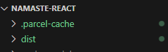
    
    - Image optimization
    - Minification and bundling of files
    - Compress files
    - Consistent Hashing
    - Code Splitting
    - Differetial Bundling - to support older browsers
    - Diagnostics
    - Good Error Handling
    - Provides way to host app on HTTPS
    - Tree Shaking - remove unused code.
    - Has Lazy mode also => npm install parcel --lazy
    - Different bundle/build for dev and production

## Dependencies
- There are 2 types are dependencies in app
    - Dev (Dev dependencies means required only in developmemt phase. For that we used -D with command) 
    - Normal

## Caret(^)
**Syntax:** ^MAJOR.MINOR.PATCH
**Behavior:** Allows updates that do not change the first non-zero number from the left. This means the minor and patch versions can be updated as long as the major version stays the same.
**Use Case:** Suitable when you want to receive non-breaking updates, ensuring that major version changes (which may introduce breaking changes) are not included automatically.
        
## Tilde (~)
**Syntax:** ~MAJOR.MINOR.PATCH
**Behavior:** Allows updates to the patch version, but fixes the minor version. This means only the patch version can be updated to newer releases, while the major and minor versions must remain the same.
**Use Case:** Suitable when you want to receive only critical bug fixes and avoid new features that might come with minor version updates.

## package.json and package-lock.json
**package.json** - configuartion for npm. Here version can caret or tiled
**package-lock.json** 
    - keeps track of exact version that is installed. It locks the dependency version installed. 
    - "Integrity" in it has the HASH(SHA512) to verify that whatever is there right now in dev machine is the same version which is being deployed on production.

## Tansitive Dependencies (Dependency tree)
- say our project has Parcel dependency which in further can have other depndencies which further can have other depenedencies and so on.. These dependencies are called transitive dependencies.
- Every package in node_modules(collection of dependencies) will have it own package.json, and further dependencies.

## .gitignore file
- since we don't want node_modules to go to git, we can add that in .gitignore

## Build project using parcel
- npx parcel "source file" (npx means executing a package)
    example -> npx parcel index.html
- all build file will get stored in "dist" folder

## Production build
- npx parcel **build** "<source file>"
- Also remove "main": "app.js" from package.json

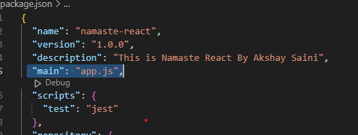
    
## Install React
- "npm install react" OR "npm i react"
  **Note:** it should not be dev dependency

## Install react-dom
- "npm install react-dom"
  **Note:** it should not be dev dependency

## Steps to make code working using npm libraries and using traditional way of app.js React code (via React.CreateElement())
- In app.js, we need to import React and ReactDOM to make the code working without CDN links and using npm libraries.
  ```js
    import React from "react";
    import ReactDOM from "react-dom/client";
  ```
- Also, we need to add "**type="module**" to start script files script tag
  ``` js
  <script type="module" src="./app.js"></script>
  ```

- app.js
  ```js
    import React from "react";
    import ReactDOM from "react-dom/client";
    
    const root = ReactDOM.createRoot(document.getElementById("root")); 
    const parent = React.createElement("div", { id: "parent" }, [
      React.createElement("div", { id: "child", key:"child1" }, [
        React.createElement(
            "h1",
            { id: "heading", key: "Child1heading1" },
            "Hello World! from react"
          ),
        React.createElement(
          "h3",
          { key: "Child1Heading2" },
          "First Child HTML creation"
        ),
      ]),
      React.createElement("div", { id: "2nd child", key:"child2" }, [
        React.createElement(
            "h1",
            { id: "heading", key: "Child2heading1" },
            "Hello World! from react"
          ),
        React.createElement(
          "h3",
          { key: "Child2Heading2" },
          "Second Child HTML creation"
        ),
      ]),
    ]);
    
    root.render(parent);
  ```

  -index.html
  ```js
  <!DOCTYPE html>
    <html lang="en">
    <head>
        <meta charset="UTF-8">
        <meta name="viewport" content="width=device-width, initial-scale=1.0">
        <title>Namaste React</title>
        <link rel="stylesheet" href="./index.css"/>
    </head>
    <body>
        <div id="root">     
        </div>    
        <!-- using react  -->
        <script **type="module"** src="./app.js"></script>
    </body>    
    </html>   
  ```

## browsersList (browserslist.dev)
- to make app compatible with older browsers
- it is an npm package
- it needs some configuration
- we need to tell our project via pakcage.json that which all browesers we need to support

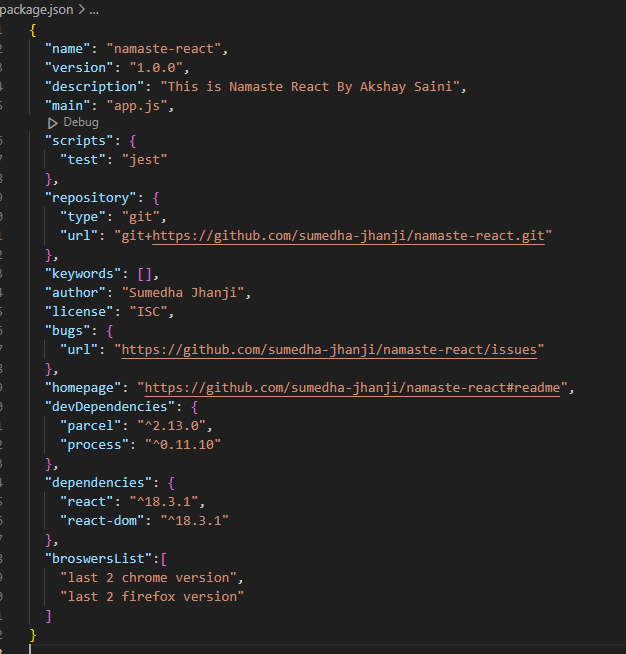
- we can give country specific list also
```js
"broswersList":[
    "last 2 version"  // last 2 versions if all the browsers
]
``` 

## Create Script to build the project
- create npm script in package.json

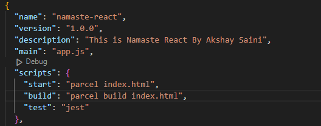

- "start" -> build and start project in dev mode
= "build" -> create production build.
- on terminal now run commmand 
  - "npm run start"
  OR
  - "npm start" ( will work only for start not for build)

## Extensions for making react code more readable
- Better Command
- Prettier Code
- ESLint
- Bracket pair colorization toggler

# JSX
- Javascript syntax which is easier to create react elements
- it is not part of react.
- convention where we can merge the markup(html) and logic(js) together
- it is **not an HTML**, it is **HTML like syntax**
- is a syntax extension for JavaScript used with React to describe what the UI should look like. 
- it allows you to write HTML-like code within JavaScript, making it easier to create and manage UI components
- component integration: You can embed React components within JSX to build complex UIs.
- You can use curly braces {} to embed JavaScript expressions within JSX.
- Js engine does not understand JSX. It is not supported by browsers. It is not valid pure javascript
- Js engine understands ES6 (ecmascript 6)
- parcel uses **Babel** and transpiled JSX code before it goes to Js engine
- JSX code => transpiled to React.CreateElement using Babel => JS oject => render() => HTML Element
- attributes in JSX are camel case
- to run any JS code in JSX, we can use {}. We can write any piece of code inside {} even console.log

## Create React Element
```js
const jsxHeading = <h1 id="heading" className="head" tabIndex="1">Namaste React</h1>
```
above JSX converts into HTML
```html
<h1 id="heading" class="head" tabindex="1"></h1>
```

- Multiple line JSX needs to wrap inside paranthesis

```js
const jsxHeading = (<h1 id="heading" className="head" tabIndex="1">
Namaste React
</h1>)
```

## Babel (babeljs.io)
- javascript compiler
- takes JSX and convert it into code that Js engine understands
- for older brwsers, babel transpiles theb ES6 code to th ES version which can be understood by browser

## React Components
- everything in react is a component
- example -> button, input box, list etc
- class based components & functional components

## Class based component
- old way fo writting code (no body uses now)
- uses javascript classes
- defined using ES6 class syntax and extend the React.Component class
- key feature
  - state management
  - life cycle methods
  - event handling
    - can handle events using methods within the class. These methods are bound to the component’s context

## Functional component
- uses javascript functions
- JavaScript functions that return JSX (JavaScript XML) and can accept props as arguments.
- use hooks to maintain state, effects etc without writing classes
- have less boilerplate code, making them more concise.
- have better performance because they are stateless by default.
- functional component name always starting with capital letter
- Js function returns react element(s).

```js
const HeadingComponent = () =>{
  return <h1>Namaste React functional component</h1>
};
```
OR
```js
const HeadingComponent = () => <h1>Namaste React functional component</h1>
```
OR
```js
const HeadingComponent = function() {
  return (<h1>Namaste React functional component</h1>)
};
```

## Render Component
```js
root.render(<HeadingComponent />)
```

## Component Composition (Render react component in react component)
- is a fundamental concept in React that involves building complex UIs by combining simpler, reusable components. 
- this approach promotes modularity and reusability, making your codebase more maintainable and easier to understand.
- render react component inside react component
- component cannot be rendered before initialization of same

```js
import React from "react";
import ReactDOM from "react-dom/client";
const root = ReactDOM.createRoot(document.getElementById("root"));
const HeadingComponent = () => {
  return (
    <div id="body">
      <h1 id="heading">Namaste React functional component - Heading</h1>
      <TitleComponent />
    </div>
  );
};

const TitleComponent = () => (
  <h1 id="title" className="title" tabIndex="3">
    Namaste React functional Component - Title
  </h1>
);

root.render(<HeadingComponent />);
```

## Render react element in react component
```js
import React from "react";
import ReactDOM from "react-dom/client";

const root = ReactDOM.createRoot(document.getElementById("root"));

//React Element
const heading = (
  <h1 id="heading" className="head" tabIndex="3">
    Namaste React
  </h1>
);

//React Functional Component
const HeadingComponent = () => {
  return (
    <div id="body">
      <h1 id="heading">Namaste React functional component - Heading</h1>
      {/* component composition */}
      <TitleComponent /> 
      {/* Render react element */}
      {heading}
    </div>
  );
};

const TitleComponent = () => (
  <h1 id="title" className="title" tabIndex="3">
    Namaste React functional Component - Title
  </h1>
);

root.render(<HeadingComponent />);
```

## Cross Site Scripting attacks (XXS)
- As data is wrapped inside {}, JSX takes care of malicious data
- JSX will escape it 
- automatically taken care by react.
- ways to prevent from XXS
  - Use JSX: React's JSX syntax automatically escapes any values embedded in JSX before rendering them, which helps prevent XSS
  ```js 
  const userContent = "<script>alert('XSS')</script>";
  return <div>{userContent}</div>; // React will escape the script tag
  ```

  - Avoid dangerouslySetInnerHTML: if you need to insert raw HTML, use dangerouslySetInnerHTML with caution and ensure the content is sanitized.
  ```js
  const sanitizedContent = sanitize(userContent); // Use a sanitization library
  return <div dangerouslySetInnerHTML={{ __html: sanitizedContent }} />;
  ```

  - Sanitize User Input: Always sanitize user input before displaying it, especially if it comes from an untrusted source
  ```js
  import DOMPurify from 'dompurify';
  const sanitizedContent = DOMPurify.sanitize(userContent);
  return <div>{sanitizedContent}</div>;
  ```
  - Use Libraries: Utilize libraries like DOMPurify or sanitize-html to sanitize user input before rendering it

## Props (properties)
- to pass data dynamically to component.
- just normal arguments to a function
- we can pass any number of props
- passing props syntax -> "propname"="value" as component property

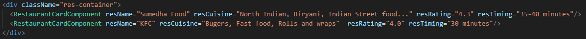
- referring passed rpop in component using {props.propname}

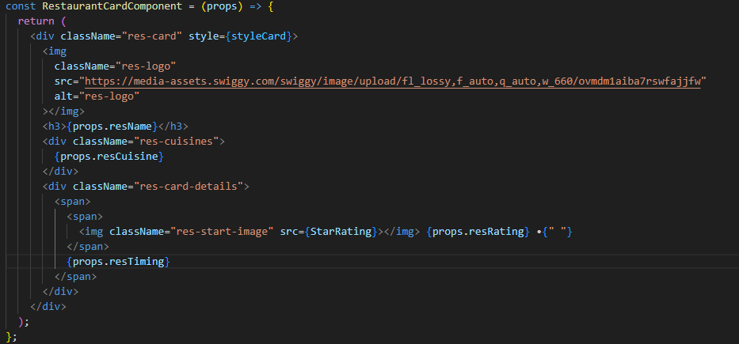

## Destructuring props
- in component, we can specify props as below

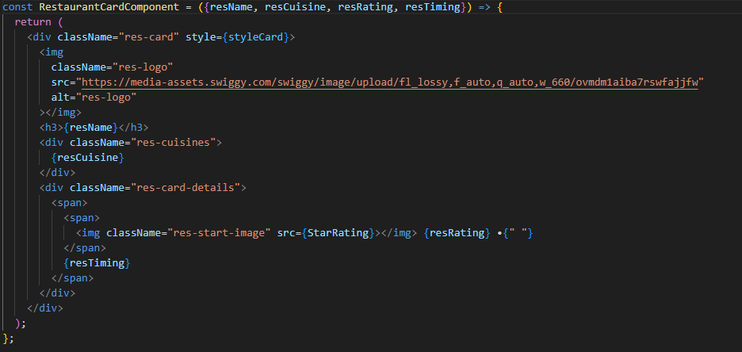

**OR**
```js
const {resName, resCuisine, resRating, resTiming} = props
```

## Config Driven UI
- website is drive by data using configs
- controlling the UI using config data.
- config comes from backend
- example food apps, they show data based on location
- is a design pattern where the structure and behavior of the user interface are defined using configuration files rather than being hard-coded into the application
- configuration files are typically in formats like JSON or YAML
- By separating the UI logic from the code, developers can easily modify the UI without changing the underlying codebase

## How Config-Driven UI Works
- Config-driven UI uses configuration files to control how the UI looks and works. 
- These files can be in formats like JSON or YAML. 
- The configuration file usually contains information about components, their properties, and how they should be arranged on the screen.
- Example: Comfiguring a form
```json
{
  "form": {
    "fields": [
      {
        "label": "Name",
        "type": "text",
        "required": true
      },
      {
        "label": "Email",
        "type": "email",
        "required": true
      },
      {
        "label": "Age",
        "type": "number",
        "required": false
      }
    ]
  }
}
```
- By parsing this configuration file, the UI can dynamically render the form based on the specified settings

## Dynamically binding to elemments in json and loop through it
- we can loop elements of object using map()

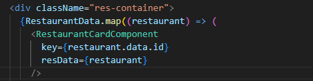

- same can then ne used at appropriate places as below

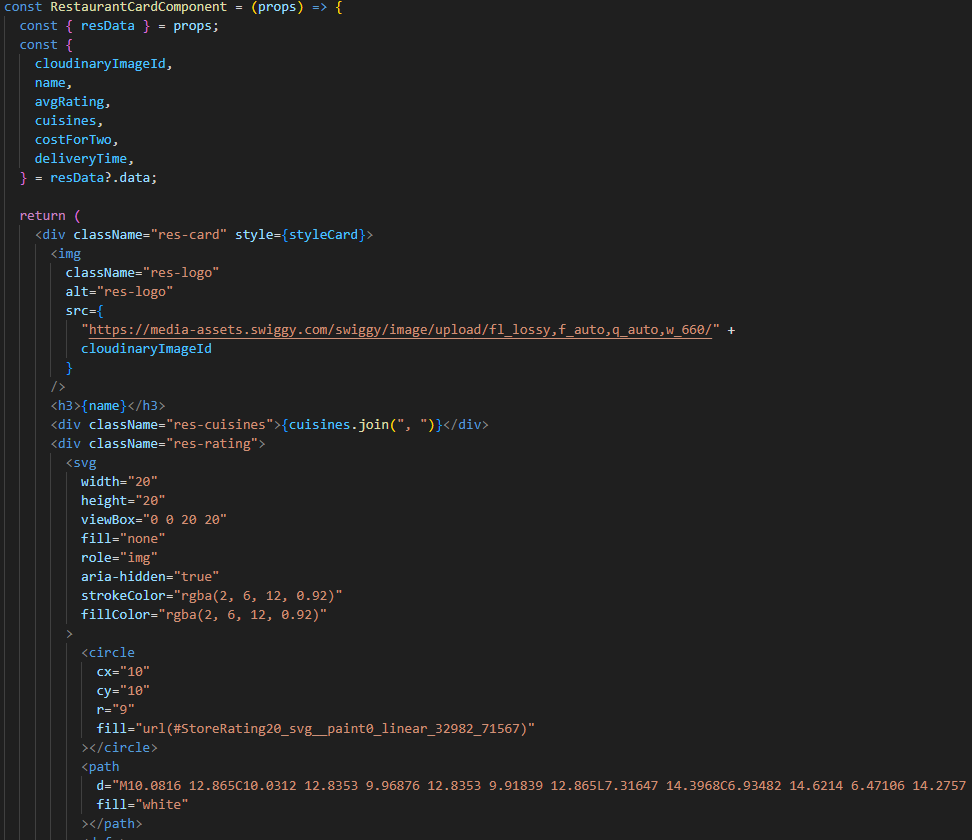


## Each child in a list should have unique key prop - Warning
- we must assign key value to each child element of list so that they can be uniquely represented
- key={}
- key is a reserved word which needs unique value like "id" 


**OR another way**
- use index which is second argument of map()- Not recommended
- if order of items change, this can negatively impact performance abd may cause issues with component state.
- it is considerd as Anti-Pattern

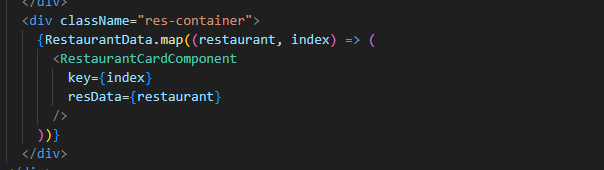


## Why we need unique key
- react optimizes its render cycle, so components need to have unique ids. 
- say, if some new component comes up, DOM has to place that at required place. 
- Using unique id, react will come to know what modification has been made. 
- Rather than re-rendering all the components, it can identify the modification using key and renders ony that.

## Sample Project UI structure (Namaste-react App)

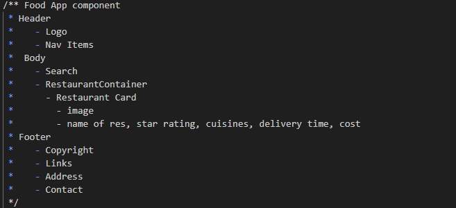

 ## Import and Export
- **Export**
- 2 types of export

 1. Default export: 
- export: to make component available for access by other components
- one file can have single export
 ```js
 export default <componentname>

 ```
2. Named export
- used when we have to export multiple things to export
- just use export against each object u want to export

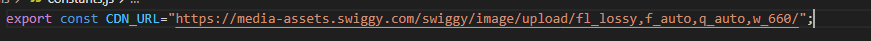

- **Import**
- 2 types of import
1. Default component's import
- import component to main component where we want to use it
 ```js
 import BodyComponent from "./components/BodyComponent";
 ```

. Named component's import 
- to import named exports, we need to use {} as below

 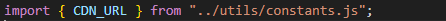


# Make App Dynamic (interactive)
- using features like Hooks, click handlers

## Event handlers
- handle events like click, mouseover etc
- example -> onclick event on button.
  - it will take callback function

  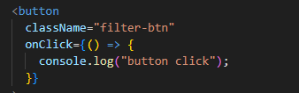

## React Hooks
- normal JS utility function given to us by react
- prebuilt
- it has some logic at behind


1. useState() 
- used to generated State variables(local state variable inside functional component) 
- Variable which has state of the component
- used to add state to functional components.
- way of 2 way binding even though react is unidirectional
- it returns the state which is consumed in array.
- it takes a default value which can be empty array, null, single value or list etc
- to modfy state variable, we need to use a function which comes as 2nd parameter of useState array. This will trigger diff algorithm.
- when ever state variable updates, react re-renders the component.
- **why we need state variable**
  - if we use local javascript variable, it will update the variable value if we update that but UI(component) won't get rendered.
  - to refresh or re-render the UI, we use state variables.
  - it is used to make the app dynamic
  - render whole component and change only the updated element. All other component react elements will remain intact

```js
import { useState } from "react";
const[resData, setResData] = useState(RestaurantData); // array destructuring on fly
```
- imported like named import i.e using {}

- **Example - we need to filter the list of restaurants wiith rating greater than 4 on click of button and show on UI (use case of useState())**
- Steps
  1. add click event to button

  

  2. define state variable using useState()

  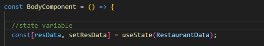

  3. use Set<variable> of useState to change state of the component-  - when we are calling set<variable> react is updating the variable name and calling/rendering the component once again. Variable will be a new variable now. New variable is created with the new value which has been updates using set function.

  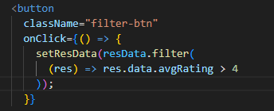

  4. Binding your mapping component (RestaurantCardComponent) with state variable

  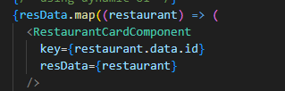

- **Best parctices**
- never create state variables outside of component.
- try to call hooks on top of component (inside component)
- Never create state vaiable inside condition/loops/functions. It is allowed in react but it will create inconsistency

2. useEffect()
- take 2 arguments
  - arrow function/ callback function : called after your component's each render
  - dependency array: changes the behavior of the render (optional)
   
```js
import { useEffect } from "react";
useEffect(() => {
  console.log("callback function");
}, [])
```

- **when useEffect() is called**
- after every render of that omponent - default baehavior
- called after each render or subsequent render of component.

## impacts of Dependency Array in hook
1. if no dependency array, useEffect will be called after every render.
```js
import { useEffect } from "react";
useEffect(() => {
  console.log("callback function");
})
```

- we can also use return with callback inside useEffect which will be called when we leave the component

```js
useEffect(() ={
  console.log("useEffect"); // called after render

  return() =>{
    console.log("useEffect return"); // called when leaveing component
  }
},[])
```

2. if dependency array is empty i.e. [], useEffect will be called on only once on initial render(when componeent loads not on re-renders)
```js
import { useEffect } from "react";
useEffect(() => {
  console.log("callback function");
}, [])
```

3. if we pass some value in dependency array, useEfect will called only when dependency's value changes
```js
import { useEffect } from "react";
const[btnName, setBtnName] = useState("Login")
useEffect(() => {
  console.log("callback function");
}, [btnName]);
```

3. useRouteError()
- given by react-router-dom
- used to hold the route errors
- it gives more information/details about error

```js
const error = useRouteError()
<h3>
  {error.status}: {error.statusText} - {error.error.message}
</h3>
```

4. useParams()
- to read the parameters value
```js
- in route configuartion
{
  path: "/restaurants/:resId",
  element: <RestaurantMenuComponent />,
}

- dynamic route link
<Link
  to={"/restaurants/" + restaurant.info.id}
  key={restaurant.info.id}
>
  <RestaurantCardComponent
    resData={restaurant}
  />
</Link>

- use this in component where we want to use the parameters passed as querystring
const { resId } = useParams();
```

5. Custom Hooks
- use to add mote modularity to the project.
- enhance more readability
- make code more reusable
- adding abstraction to custom code (hiding the implementation)
- best practice 
  - create new file separately for each hook
  - always create hook file starting with "use", react will understand that it is hook
- **Steps to create Custom Hooks**
  - create a new file whose name starts with "use"
  - add the logic
  - export it
  - use it just like the other hooks
  ```js
  import { useEffect, useState } from "react";
  import { MENU_API } from "../utils/constants";

  const useRestaurantMenu = (resId) => {
    const [resInfo, setResInfo] = useState(null);
    useEffect(() => {
      fetchMenu();
    }, []);

    const fetchMenu = async () => {
      const data = await fetch(MENU_API + resId);
      const json = await data.json();
      setResInfo(json.data);
    };

    return resInfo;
  };

  export default useRestaurantMenu;
  ```
  - in component that neefds to use it
  ```js
  const resInfo = useRestaurantMenu(resId); // called custom hook
  ```


## Diff algorithm & Reconciliation algorithm
- **Diff algorithm**
- Diff algorithm will find out then difference between 2 virtual DOMs(updated Virtual DOM and previous virtual DOM) and then will actually update the DOM.
- This process is necessary because React uses a virtual DOM to improve performance by minimizing direct manipulation of the actual DOM.
- Key Points:
  - Virtual DOM: React creates a virtual representation of the real DOM. Whenever the state of a component changes, a new virtual DOM is created.
  - Comparison: The diff algorithm compares the new virtual DOM with the previous version to identify changes.
  - Efficiency: The algorithm is designed to be efficient, with an O(n) complexity, meaning it operates linearly relative to the number of elements.
- Steps in Diffing:
  - Element Type Change: If elements of different types are compared, React destroys the old tree and builds a new one from scratch.
  - Key Usage: Keys are used to identify elements uniquely. This helps React efficiently update the list without re-rendering unchanged elements.
  - Component Tree Comparison: The algorithm recursively compares the component tree. If the root elements are the same, it compares their attributes and children.

- **Reconciliation alogorithm**
- React uses Reconciliation alogorithm also known as React Fiber. Came in react 16.
- Reconciliation alogorithm is the process React uses to update the DOM by applying the differences identified by the diff algorithm.
- The goal is to update the UI efficiently by minimizing the number of changes to the actual DOM.
- Key Points:
  - Minimal DOM Manipulation: React applies only the necessary changes to the DOM to bring it to the desired state.
  - Batch Updates: React batches multiple updates together to improve performance and avoid unnecessary re-renders.
  - Lifecycle Methods: During reconciliation, React calls appropriate lifecycle methods like componentDidUpdate to manage component behavior.
- Steps in Reconciliation:
  - Element Update: If an element remains the same, React updates its attributes and children accordingly.
  - Component Update: If a component remains the same, React updates its props and state, triggering re-renders only if necessary.
  - Component Mounting/Unmounting: React mounts new components and unmounts old ones as per the diff algorithm's findings.

- Example
    - suppose we have DOM in which we have res-ccontainer which has say 15 res cards
    - UI performs filtering and gets 3 cards.
    - To update this in actual DOM
      -  Firstly, react will create Virtual DOM(representation of actual DOM -> basically object of react elements) from actual DOM(HTML elements)
      - Using diff algo, will identify the diff between old virtual DOM (containing 15 res cards) and new virtual DOM (contains 3 res cards)
      - using Reconciliation alogo, will update the actual DOM by applying the diff identified. It will update DOM without re-rendering the unchanged items. It will render the whole component again which has been updated.

## **React Fiber Architecture**
- https://github.com/acdlite/react-fiber-architecture


## Approaches how web apps or UI applications fetch data from backend
1. As soon as app loads, we can make api call to fetch data, wait for data to come and then render it on UI.
2. As soon as page loads, we will quickly render UI, after render, we will make API call and when we get data, we will render data to our app.
  - We will always use this approach in React
  - provided better User experience as in first approach, it will block page for some time where as we load the page with skeleton and as soon as we get data, we render that on UI.
  - React's render cycle is very fast so 2 times render doesn't affect the performance.
  - we will useEffect() hook for this

## How to read data from API
- use fetch api provided by browser
- fetch will return promise which can then be resolved either
  - using .then()
    **OR**
  - using async await
```js
const fetchData = async() =>{
  const data = await fetch("api url");

  const json = await data.json();
};
```

## CORS Policy
- browsers blocks us to call api from one origin to another origin
- way to bypass
  - add browser extension for CORS (for dev environment)
  - **OR**
  - use corsproxy.io or we have other sites also for this. Just append  **https://corsproxy.io?** before url
    - https://corsproxy.io?https://www.swiggy.com/dapi/restaurants/list/v5?lat=30.6601508&lng=76.8382204&is-seo-homepage-enabled=true&page_type=DESKTOP_WEB_LISTING
    - it has a limit.
  - **OR**
  - if we have our own api, there we can use CORS middleware

## Optional chaining (?.) 
- is a feature in JavaScript that allows you to safely access deeply nested properties without having to check each level explicitly. This feature helps to avoid errors when accessing properties that might not exist.
- You can also use optional chaining to call a function that might not exist.
- Optional chaining can be useful when working with arrays and checking for elements at specific indices.

- **How It Works**
The optional chaining operator (?.) short-circuits and returns undefined if the value before it is null or undefined. This prevents runtime errors that occur when trying to access properties of null or undefined.

- **Advantages**
- Reduces Code Complexity: Simplifies the code by reducing the need for multiple checks for null or undefined.
- Improves Readability: Makes the code cleaner and easier to read.
- Prevents Errors: Helps avoid runtime errors caused by accessing properties of null or undefined.

## Shimmer UI
- resembles the page's actual UI, so users will understand how quickly the web or mobile app will load even before the contnt has shown up
- it is like of kind, we load a fake page until we load actual data.
- as soon as page load, load/render it with shimmer UI


## Conditionl Rendering
-Rendering on base of vondition is called conditional rendering

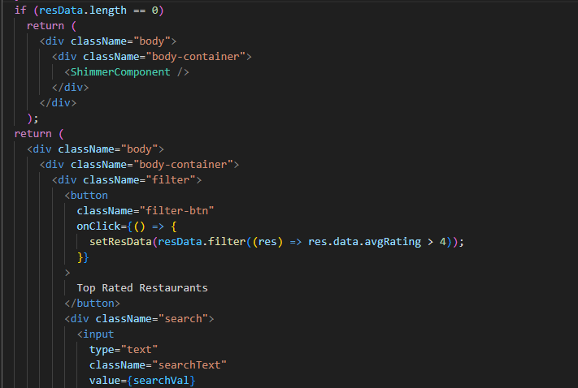

## Key concept
- say we have input box and we have binded local state variable to that. If we try to modfy input box, it won't be possible. This is because value of input box is strictly tied to variable. It will keep the old value intact unless we change the variable value using set<variable>
- to resolve this we need to use onChange event handler

```js
const [searchText, setSearchText] = useState("");
 <input
              type="text"
              className="search-text"
              value={searchText}
              onChange={(event) => {
                setSearchText(event.target.value);
              }}></input>
```
- **Note:** when we change local state variable(either we are typing anything in input box, making clal to api etc), Component gets re-rendered as react triggers a reconcilliation cycle

- **Note: React will re-render the whole component but it is only updating the input box value in actual DOM**

# Routing (https://reactrouter.com/home)
- use react router dom library
- npm i react-router-dom
  - it has created an error page byitself which is displayed to user in case user goes for unconfigured route path.

- **2 Types of routing in web apps**
  - Client side: no netwrok calls. We already have components and just loads the same at specified location. In react, w eare implementing this type of routing
  - Server Side: you go for navigation link, network call gets fired and it will get HTML from server and render the whole page

- **Steps**
- **Ist way**
  - create routing configuartion
  ```js
  import { createBrowserRouter } from "react-router-dom"; // createBrowserRouter will create routing cofiguration for us

  const appRouter = createBrowserRouter([
    {
      path: '/',
      element: <AppLayout />,
    },
    {
      path: '/about',
      element: <AboutComponent />,
    },
  ]);
  ```

  - next we need to provide this configuration to render it.
    - use RouterProvider component provided by react router dom
    ```js
    import { createBrowserRouter, RouterProvider } from "react-router-dom";
    root.render(<RouterProvider router={appRouter}></RouterProvider>)
    ```

- **2nd Way**
```js
import { BrowserRouter, Routes, Route } from "react-router";
root.render(
  <BrowserRouter>
    <Routes>
      <Route path="/" element={<AppLayout />} />
      <Route path="/about" element={<AboutComponent />} />
    </Routes>
  </BrowserRouter>
);
```

- to show custom error page, we can provide errorElement in route
```js
 {
    path: "/",
    element: <AppLayout />,
    errorElement:<ErrorComponent />
  },
```

## Children routes
- say we want header component tto remain intact and body component will get replaced with other route components
- for this we need to define child routes using children as below
```js
const appRouter = createBrowserRouter([
  {
    path: "/",
    element: <AppLayout />,
    children: [
      {
        path: "/",
        element: <BodyComponent />,
      },
      {
        path: "/about",
        element: <AboutComponent />,
      },
      {
        path: "/contact",
        element: <ContactComponent />,
      }
    ],
    errorElement: <ErrorComponent />, // for custok error page
  }
]);
```
- use outlet from react-router-dom
```js
import { createBrowserRouter, RouterProvider, Outlet } from "react-router-dom";
const AppLayout = () => {
  return (
    <div className="app">
      <HeaderComponent />
      <Outlet /> {/* won't be visible in the html */}
    </div>
  );
};
```

- link the routers to elements for navigation
  - don't use <a></a> as it will refersh whole page
  - rather use ink **component**. We can navigate the page without reloading. It will just refresh the component as react app is SPA. Behind the scene, it is converting into anchor tag when rendered. Link is a wrapper over anchor tag
```js
import { Link } from "react-router-dom";

<div className="header">
  <div className="logo-container">
    </img>
  </div>
  <div className="nav-items">
    <ul>
      <li>
        <Link to="/">Home</Link>
      </li>
      <li>
        <Link to="/about">About</Link>
      </li>
      <li>
        <Link to="/contact">Contact Us</Link>
      </li>
      <li className="image-cart">
        Cart </img>
      </li>
      <li>
        <button className="login" onClick={handleBtnName}>
          {btnName}
        </button>
      </li>
    </ul>
  </div>
</div>
```

## Dynamic Routing
- example in swiggy we are having list of restaurants, now we click a specific restaurant, this is done using dynamic route. In this we will make API call
- in route configuartion , we need to specify the dynamic value using ":"
```js
{
  path: "/restaurants/:resId",
  element: <RestaurantMenuComponent />,
} // here :resId is dynamic which will be the id of selected restaurant
```

# Class based components
- old way of creating components
- normal javascript class
- extends React.Component : a class given by React
- it will have render method inside it which will return a piece of JSx which will be displayed on UI

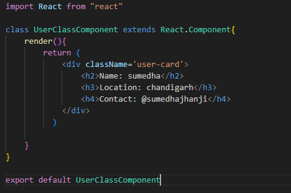

## pass props to class component
- use constructorr to receive props
- call super(props) in constructor
  - When you extend a class (in this case, React.Component), the derived class (your component) inherits the properties and methods of the parent class.
  - Calling super(props) ensures that the parent class's constructor is executed
  - you need to call super() before you can use this to access or set any properties within your component's constructor.
  - When you pass props to super(props), it allows the parent class (React.Component) to properly initialize the this.props property.
- use "this.props.<propname>" keyword

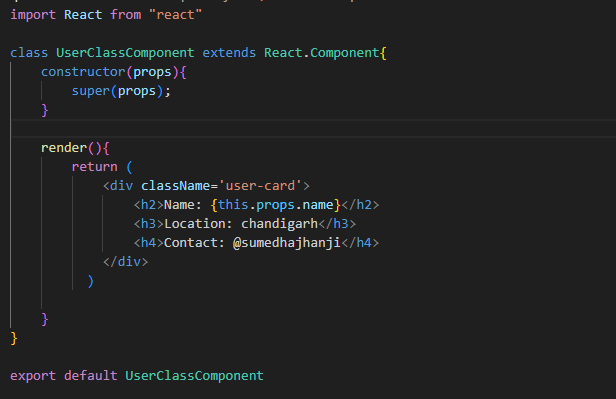

## create and use state variables in class components
- use this.State in constructor
```js
this.state={
    phone: "XX-XX-XX-XX-XX", // initial value
    emailID: "abc@gmail.com"
}
```
- use this.state.<statevariable>
```js
<h5>Phone: {this.state.phone}</h5>  
```

- In **functional component**, we need to use "useState" as many as we need local variable. Behind the scene they will become single object
- In **class component**, this.state is big object and contains all the state varibales

## update state variables in clas component
- we don't modify state variable directly
- use this.setState to update the state. It will take object where we pass updated value. It will re-render the component and can be sed anywhere in the component
```js
<button onClick={() => {this.setState({phone: "YY-YY-YY-YY-YY"})}}>Update state variable</button>
```

- **Note:** 
  - calling/loading a function component on web page = mounting/invoking a function
  - loadng a class based component on web page = creating an instance of that class

  ## Life cycle of class based component

  - **Parent is functional and child is class based**
  - Say, we have a parent - About Component(functional Component) and inside that, we have refered child - User Component (class based compoenent)
  - when About component gets loaded in web page, it start getting rendered line by line
  - as soon as it encounter child component, it starts loading that.
  - since child component is class based compoenent
  - it will instantiate it and at first step, it will call its Constructor
  - then render is called
  - then ComponentDidMount() is called

  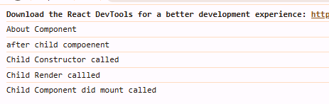

  - **Parent is class based and child is class based**
  - Say, we have a parent - About Component(class b ased Component) and inside that, we have refered child - User Component (class based compoenent)
  - when About component gets loaded in web page, its constructor will get called and then it start getting rendered line by line i.e. render() will get called
  - as soon as it encounter child component, it starts loading that.
  - since child component is class based compoenent
  - it will instantiate it and at first step, it will call its Constructor
  - then render is called
  - then ComponentDidMount() is called
  - then parent ComponentDidMount() is called

  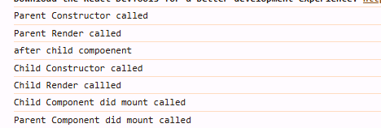

  - ComponentdidMount() : used to make API calls

  - **If we have multiple child components, life cycle**
  - Parent constructor
  - parent render
    - first child constructor
    - first child render

    - second child constructor
    - second child render

    - first child component did mount
    - second child component did mount
  - parent child component did mount

  - **if order isbelow, life cycle will be**
  - parent
    - child 1
      - grandchild1
    - child 2
      - grandchild2

    - life cycle
      - parent constructor
      - parent render
        - child 1 constructor
        - child 1 render
          - grandchild1 constructor
          - grandchild1 render
        - child 2 constructor
        - child 2 render
          - grandchild2 constructor
          - grandchild2 render
        
        - grandchild1 component did mount
        - child 1 component did mount
        - grand child 2 component did mount
        - child 2 component did mount
      - parent component did mount


  - React has 2 phases in life cycle
    - Render: react will batch the render of all child components and then will go to commit phase and update DOM based on that
      - it includes constructor
      - render
    - Commit
      - react updates DOM and refs (DOM manipulation starts in single batch)
      - then call component did mouunt

  - inside
    - constructor
    - render
    - will update DOM (loaded) 
    - component did mount


## how to make API call in class based component
- make your componentDidMount() as async
- make use of fetch api to url for data.
```js
async componentDidMount() {
  const data = await fetch("https://api.github.com/users/sumedha-jhanji");
  const json = await data.json();
}
```

## update web page with fetched data
- define a state variable 
- use this.setState to update the state variable after call to api

## how update happens behind the scene
- Constructor (default data)
- render (default data)
- React updates the DOM  (with defsult values of state)
- Component Did Mount
- we called setState in componentdidmount, it will intiate the updating process or it triggers the reconcilliation cycle in update cycle
- again render will be called with api data
- this time state variable is having updated values from api
- react will calculate the diff and update the DOM
- Component did Update will be called. only becaue update happened in component. If no update happened then it will not be called

## ComponentDidMount()
- after first render only
## ComponentDidUpdate()
- after each re-render
## componentWillUnmount
- removing from UI
- i.e. when we try to move to other component
- only once when we unload the component
- say we have defined setInterval() in component did mount, now we move from one component to another and so on. It will initiate multiple setInterval in backend. So to clear that out when we leave the component, we need componentWillUnmount(): it is used to clear the resources which are occupying the resource not needed once we leave the components


# Custome Hooks examples

## Check internet status
- we need to add the event listener provided on windows  (online/offline)
```js
import { useEffect, useState } from "react";

const useOnlineStatus = () => {
  const [onlineStatus, setOnlineStatus] = useState(true);

  // becuase need to add event listener only once
  useEffect(()=>{
    
  //check if online or not, for that we need to adde event listener
    window.addEventListener("online",() =>{
        setOnlineStatus(true);
    });

    window.addEventListener("offline",() =>{
        setOnlineStatus(false);
    });
  },[])

  //return boolean value
  return onlineStatus;
};

export default useOnlineStatus;
```

## Chunking / Code Splitting / Dynamic bundling / Lazy loading / On Demand Loading
- Say we have large scale app, so when we create dev/prod buid, parcel will create single js file. 
- it is ok in case of small apps but for larger apps with lot of components, we should create small bundles so that they can be fastly loaded on browers.
- that process of creating small bundles is called chunking
- initially component is not loaded
- we will do using lazy laoding

- **Steps**
  1. import lazy from react: lazy is named export function, it takes call back function
  ```js
  import React,{lazy} from "react";
  ```
  2. use lazy with callback function
  ```js
  const Grocery = lazy(() => import("./components/GroceryComponent")); // import is a function here and it will take path of the component need to be loaded
  ```
  3. we need to use suspense: it is a component
  - as we now are requesting a component to load dynamically. so there will be state (due to component getting loaded dynamically) when the component is not avaiable might be for very few milliseconds. As a result, react will suspend the rendering and will throw error
  - that can be resolved with Suspense component
  - fallback is place holder where we provide the value which we want to display during that state when component is laoding in case of lazy loading
  ```js
  {
    path: "/grocery",
    element: (
      <Suspense fallback={<h1>Loading....</h1>}>
        <Grocery />
      </Suspense>
    ),
  }
  ```

# CSS
## Ways to write css
1. traditional way using .css file, attributes like className
2. use SASS (writing css with some super powers) or SCSS : not recommended with large projects.
3. Styled Components : mostly used with react applications by various companies (https://styled-components.com/)
```js
import styled from 'styled-components'
const Button = styled.button`
  background: transparent;
  border-radius: 3px;
  border: 2px solid #BF4F74;
  color: #BF4F74;
  margin: 0 1em;
  padding: 0.25em 1em;
`
```
4. using css libraries and frameworks: provide pre-build components
  a. Material UI (MUI)
  b. Bootstrap
  c. Chakra UI
  d. Ant design
5. Tailwind CSS (today trending one) : Generic CSS framework: Rapidly bbuild moder websites without ever leaving your HTML/JSX

## Tailwind (https://tailwindcss.com/docs/guides/parcel)
- it is very light weight, when parcel will make bundle of CSS, it will only include css that is required in app not the whole tailwind css available
  - like if we have not used shadow, it will not include shadow css.
  - if you are using say m-4 100 times, it will just import only one m-4 class in bundle
- we can build complex app
- we can define css to handle various screen sizes
- we can easily apply light dark theme

- **Steps to use it in React**
  - since we are using parcel, so go to tailwind site -> Docs -> Get Started -> choose "Framework Guides" -> choose Parcel
  - Run commands to install tailwindcss and postcss(a tool to transform a css with javascript)
  ```js
  npm install -D tailwindcss postcss
  npx tailwindcss init // initializing tailwind in app, it will create new file tailwind.config.js (cionfiguration file)
  ```
  - Configure PostCSS: Create a .postcssrc file in your project root, and enable the tailwindcss plugin
  ```js
  {
  "plugins": {
    "tailwindcss": {}
  }
  }
  ```
  - Configure your template paths: Add the paths to all of your template files in your tailwind.config.js file.
  ```js
  content: [
    "./src/**/*.{html,js,ts,jsx,tsx}", // list of all files where we are going to use tailwind
  ],
  ```

  - now start using classNames for UI look (we can install "Tailwind CSS IntelliSense" for help)

  ## Disadvantags of Tailwind
  - it some trime slooks ugly if try to use it prrbuilt components
  - it needs some learning curve before using it

# Testing
## Types
- Manual testing
- using libraries write test cases which will test code automatically
  - types
    - Unit testing: test react component(s) in isolation example we want to just test header component. we will write test cases only to verify that it got properly rendered and functioning
    - Integration Testing: testing the integration of components. Test some particular flow composed of few components
    - End to End testing (e2e) : testing react from say user landing on to the app till he logouts (through out the app)
   
## libraries
- react testing library (https://testing-library.com/docs/react-testing-library/intro/)
  - builds on top of DOM Testing Library by adding APIs for working with React components.
  - already integrated if we have created app using create-react-app
  - uses JEST (https://jestjs.io/)
    - delightful Javascript Testing Framework with a focus on simplicity
    - it inturn uses babel
      
## steps to use react testing library
- npm install -D @testing-library/react   : install react testing library
- npm install -D jest   : install jest
- npm install --save-dev babel-jest @babel/core @babel/preset-env   : install other babel dependencies
- configure babel (babel.config.js)
```js
module.exports = {
  presets: [['@babel/preset-env', {targets: {node: 'current'}}]],
};
```
- since parcel internally uses babel, so it will conflict with our above babel configuration. so we need to configure parcel file to disable parcel babel configuration (read "https://parceljs.org/languages/javascript/" -> "babel/usage with other tools" part)
  - create .parcelrc file
  ```js
  {
    "extends": "@parcel/config-default",
    "transformers": {
      "*.{js,mjs,jsx,cjs,ts,tsx}": [
        "@parcel/transformer-js",
        "@parcel/transformer-react-refresh-wrap"
      ]
    }
  }
  ```
  - npx jest --init    : do jest consfiguration
      - for test environment choose "jsdom (browser-like) : since test cases are not running on browser, they need runtime to execute it, we use jsdom - library which parses and interacts wth assembled HTML just like browser)
- npm install --save-dev jest-environment-jsdom    : install jsdom library for jest 28
- create folder say under src/components names "__tests__" OR create file name *.(spec|test.[jt]s"
- **Note:** __ is know as dunder (dunder tests), used as reserved word
- use "test(string, callback function)" to start writing a test case

```js
sum.js
export const sum = (a, b) =>{
return a+b
}
```

```js
sum.spec.js
test("sum of 2 numbers",() ={
  const result = sum(3, 4);
  //assertion
  expect(result).toBe(7);
})
```

## Higher Order components
- takes components as input and return components as output
- enhaces the features of input component
- pure functions as it doesn't change existimg functionality of passed input function
```js
- RetaurantCard function
//Higher Order component
// Input - RestarurantCard,  output is => RestarurantCardPromoted

export const withOpenLabel = (RestaurantCard) => {
  return (props) => {
    return (
      <div>
        <label className="absolute bg-black text-white m-1 p-1 rounded-lg">
          Open
        </label>
        <RestaurantCard {...props} />
      </div>
    );
  };
};

- body component
import RestaurantCardComponent, {
  withOpenLabel,
} from "./RestaurantCardComponent";

const RestaurantCardOpened = withOpenLabel(RestaurantCardComponent);

{/* If the restaurant is open then add a promoted label to it */}
{restaurant?.info.isOpen ? (
  <RestaurantCardOpened resData={restaurant?.info} />
) : (
  <RestaurantCardComponent resData={restaurant?.info} />
)}
```

## Controlled and Un-Controlled Components
- Controlled component: controlling the child componet via a parent component.
- Uncontrolled component: component who has its own state
- example - say we have RestarurantMenu component which loads RestaurantCategory component. If RestaurantCategory maintains its own state  it is called Uncontrolled component. When we lift its state up to parent i.e to RestarurantMenu component, then it is called as controlled component.

```js
- Example of uncontrolled component

import React, { useState } from "react";
import ItemListComponent from "./ItemListComponent";

//
const RestaurantCategoryComponent = ({ data }) => {
 const [showItems, setShowItems] = useState(false);

  const handleClick = () => {
    setShowItems(!showItems);
  };
  return (
    <div>
      {/* Header */}
      <div className="w-6/12 mx-auto my-4 bg-gray-50 shadow-lg p-4">
        <div
          className="flex justify-between cursor-pointer"
          onClick={handleClick}
        >
          <span className="font-bold text-lg">
            {data.title} ({data.itemCards.length})
          </span>
          <span>⬇️</span>
        </div>
        {showItems && <ItemListComponent items={data.itemCards}  />}
      </div>
    </div>
  );
};

export default RestaurantCategoryComponent;
```

```js
- Example of controlled Component
- Child component
import React from "react";
import ItemListComponent from "./ItemListComponent";

//showIndex and setShowIndex are used to control the state of child component
const RestaurantCategoryComponent = ({ data, showItems, setShowIndex }) => {
  const handleClick = () => {
    setShowIndex(); // child component will be able to modify the state variable of parent
  };
  return (
    <div>
      {/* Header */}
      <div className="w-6/12 mx-auto my-4 bg-gray-50 shadow-lg p-4">
        <div
          className="flex justify-between cursor-pointer"
          onClick={handleClick}
        >
          <span className="font-bold text-lg">
            {data.title} ({data.itemCards.length})
          </span>
          <span>⬇️</span>
        </div>
        {showItems && <ItemListComponent items={data.itemCards}  />}
      </div>
    </div>
  );
};

export default RestaurantCategoryComponent;


-In parent component
const [showIndex, setShowIndex] = useState(null);

<RestaurantCategoryComponent
  key={category?.card?.card.title}
  data={category?.card?.card}
  showItems ={index === showIndex ? true : false}
  setShowIndex={() => setShowIndex(index)} // child component will be able to modify the state variable of parent
/>
```

## How child component can modify state of parent component
- indirectly
```js
- parent component
<RestaurantCategoryComponent
  key={category?.card?.card.title}
  data={category?.card?.card}
  showItems ={index === showIndex ? true : false}
  setShowIndex={() => setShowIndex(index)} //pass function to child component as prop
/>
```

```js
- child component
const RestaurantCategoryComponent = ({ data, showItems, setShowIndex }) => {
 const handleClick = () => {
    setShowIndex(); // call function passed from parent for parent conponent state  change
  };
}
```

## Props Drilling
- react is one way
- we might need to pass data from one component down to other some where in hirerchy
- to achieve that we pass data as prop from one component to another and so on.

## React Context
- access data from anywhere
- we keep some data at global level and can access where ever it is available
- **Steps to create**
- use react library "createContext()": it needs some information that it will hold
```js
import { createContext } from "react";

const UserContext = createContext({
    loggedInUser:"Default User",
});

export default UserContext
```
- to use the same in component, we need to use hook "useContext(contextname)"
```js
import { useContext } from "react";
const {loggedInUser} = useContext(UserContext);
```

- **Note:** in class based components we don't have hooks. We use **Context consumer**. So we need to follow below way to use context
1) import Context say UserContext
2) use <UserContext.Consumer>
3) inside that we need to use call back function to access data from context
```js
import UserContext from "../utils/userContext";
<UserContext.Consumer>
  {(data) => data.loggedInUser}
</UserContext.Consumer>
```

- **Steps to Edit UserContext Data - we use context provider**
- it is performant i.e. it has super peformance
- Example - we make an API call and need to update the logged in user name in context.
1) make call to api and set some state variable
2) wrap the component where we want the updated value of context in ContextName.Provider tag and provide the new value to context
```js
const [userName, setUserName] = useState();

useEffect(() => {
  //Make an API call and sdend user name and password
  const data = {
    name: "Sumedha Jhanji",
  };
  setUserName(data.name);
}, []);

return (
    <UserContext.Provider value={{ loggedInUser: userName, setUserName }}>
      <div className="app">
        {/* Header */}
        <HeaderComponent />
        {/* if path= /  then body component */}
        {/* if path= /about   then aout component*/}
        {/* if path= /contact   then ContactComponent*/}
        <Outlet />
        {/* Footer */}
      </div>
    </UserContext.Provider>
);
```

- we can have nested context providers too. Value depends upon the place where provider has been added
```js
return (
  //default value of context
  <UserContext.Provider value={{ loggedInUser: userName, setUserName }}>
    {/* context: sumedha jhanji */}
    <div className="app">
      {/* Header */}
      {/* <UserContext.Provider value={{ loggedInUser: "Nested Context" }}> */}
      {/* context: Nested Context */}
      <HeaderComponent />
      {/* </UserContext.Provider> */}
      {/* if path= /  then body component */}
      {/* if path= /about   then aout component*/}
      {/* if path= /contact   then ContactComponent*/}
      <Outlet />
      {/* Footer */}
    </div>
  </UserContext.Provider>
);
```

- **Note:** setUserName is provided to components as part of context which we can extract using useContext hook in other component and can call it to modify the value of context state.
- - example, we have some text box in say body componnet, we want to update value of loggedInUser with value entered in text box here.
```js
- body component
 const {loggedInUser, setUserName} = useContext(UserContext);

<div className="search m-4 p-4 flex items-center">
  <label>UserName : </label>
  <input
    className="border border-black p-2"
    value={loggedInUser}
    onChange={(e) => setUserName(e.target.value)}  //setUserName if from context provided by app.js
  />
</div>
```

- **Note:** we can pass state as well as method to update the same via context provider

# REDUX (other libraries like Zustand)
- separate library than react
- we import it in our projects
- it is at data layer end.
- used for STATE MANAGEMENT
- adv: debugging/testing of app is easy
- redux dev tools are available
- libraies: react-redux(bridge gap between toolkit and react) & react toolkit (rtk : new and standard way of writing redux logic)
- redux was having too much boiler plate code but redux toolkit has short code.
- as per redux -> u should not mutate the state
- as per redux toolkit, u should either mutate the state or return the new state.

## Redux Store
- big object which is kept at central place
- any can access that store to read and write data.
- redux store has slices in it : Logical partitions to keep separate data like user slice, cart slice etc
- we cannot directly **modify** the slice in store.
  - firstly we need to dispatch an action. like when we click on Add button, it will **dispatch** an **action**
  - **action** will call a **function**. This function is known as **Reducer**
  - **function** will modify the **slice in store**.
- We can **read** data from slice in store as below:
  - we will use **selector**
  - This phenomina is known as **subscribing to store**
 
- **example**
- **Write flow:** Add item button click -> dispatch an action -> call reducer function -> add item to store
- **Read flow:** cart will use selector and will subscribe to store to get data.

## Redux toolkit
- install redux toolkit library (@reduxjs/toolkit)
- install react redux library (react-redux)
- build our store
- Connect store to app
- Slice (cartslice) to add items to cart
- dispatch (action)
- Selector

```js
- appStore.js
import { configureStore } from "@reduxjs/toolkit";

const appStore = configureStore({
  //add slices
  //one big reducer which cna contain multiple reducers in it
  reducer: {
      cart:cartReducer
      //we can add further sliced reducers here like user: userReducer etc
  }

});

export default appStore;
```

```js
- provide store to app in app.js
<Provider store={appStore}>
  <UserContext.Provider value={{ loggedInUser: userName, setUserName }}>
    <div className="app">
      <HeaderComponent />
      <Outlet />
    </div>
  </UserContext.Provider>
</Provider>
```

```js
- cartSlice.js
import { createSlice } from "@reduxjs/toolkit";

const cartSlice = createSlice({
  name: "cart",
  initialState: {
    items: [],
  },
//multipe reducers
  reducers: {
    //here addItem is action and function against is reducer function
    addItem: (state, action) => {
        state.items.push(action.payload);
    },
    removeItem:(state, action) =>{
        const index = state.items.findIndex((x) => x === action.payload);
        const newItems = [
           ...state.items.splice(0, index),
           ...state.items.splice(index + 1),
        ];
        state.items = newItems;
    },
    clearCart :(state) => {
        state.items.length = 0;
    }
  },
});

export const{addItem, removeItem, clearCart} = cartSlice.actions;

export default cartSlice.reducer; // exporting it as single reducer
```

```js
- header component where we will be reading state item
const cartItems = useSelector((store) => store.cart.items)
```

```js
- component where we want to modify the store
import { useDispatch } from "react-redux";
import { addItem, removeItem } from "../utils/cartSlice";
const dispatch = useDispatch();
const handleAddItem=(item) =>{
  dispatch(addItem(item));
}
```

- useSelector() : for reading i.e. to subscribe to store slice
- useDispacther(): used to dispatch the actions from store. It returns "dispatch()" function
  
## UNIT TESTING - react component
- firstly to test any component, we need to render that component first in to JSDOM
- to check if component rendered or not, we use "SCREEN" object from react-testing library
- install library **"npm install -D @babel/preset-react"** to allow jsx inside the test cases. It helps to convert jsx code to normal html code
- also include  @babel/preset-react inside babel.config.js
```js
babel.config.js
const { runtime } = require("./jest.config");

module.exports = {
  presets: [
      ['@babel/preset-env', {targets: {node: 'current'}}],
      ['@babel/preset-react',{runtime: "automatic"}]
  ],

};
```

- install a library for "tobeInTheDocument()" to work. Library **@testing-library/jest-dom**
``` js
const { render, screen } = require("@testing-library/react")
const { default: ContactComponent } = require("../ContactComponent")
import '@testing-library/jest-dom'; // include jest-dom for "toBeInTheDocument"

test("Should load contact us component", () =>{
    //rendered component in JSDOM
    render(<ContactComponent />);

    //get all the headings from component using "Screen" object of react-testing library
    const heading = screen.getByRole("heading");

    //it will verify, whether the heading is there in document or not.
    //Assertion
    expect(heading).toBeInTheDocument();
});

test("Should load button inside contact us component", () =>{
    render(<ContactComponent />);

    const button = screen.getByRole("button");
    //Assertion
    expect(button).toBeInTheDocument();
});

test("Should load button inside contact us component by text", () =>{
    render(<ContactComponent />);
    
    const button = screen.getByText("Submit");
    //Assertion
    expect(button).toBeInTheDocument();
});

test("Should load input name inside contact us component", () =>{
    render(<ContactComponent />);
    
    const input = screen.getByPlaceholderText("name");
    //Assertion
    expect(input).toBeInTheDocument();
});

test("Should load 2 input boxes inside contact us component", () =>{
    render(<ContactComponent />);
    //Querying
    const inputBoxes = screen.getAllByRole("textbox");
    //Assertion
    expect(inputBoxes.length).toBe(2)
});

test("example of not toBe (inverse)", () =>{
    render(<ContactComponent />);
    
    //Querying
    const inputBoxes = screen.getAllByRole("textbox");
    //Assertion
    expect(inputBoxes.length).not.toBe(3)
});
```

- if we do console.log() in test case, it will return JSX element/ react fiber node.

## Group test cases
- describe()
```js
describe("", () =>{
  test("", () =>{});
  test("", () =>{});
  describe("",() =>{
     test("", () =>{});
     test("", () =>{});
  })
});

describe("", () =>{
  test("", () =>{});
  test("", () =>{});
  describe("",() =>{
     test("", () =>{});
     test("", () =>{});
  })
});

```

- we have few helper functions that can run before or after test case. Usecase - we need to perform any use case
```js
beforeAll(() =>{
      console.log("run this function before all the tests");
  });

  beforeEach(() =>{
      console.log("run this function before each test");
  });

  afterAll(() =>{
      console.log("run this function after all the tests");
  });

  afterEach(() =>{
      console.log("run this function after each test");
  });
```

- we can also use "it()" in place of "test()".  it is alias of test

```js
describe("Contact Us Test cases", () =>{

    test("Should load contact us component", () =>{        
    });
    
    it("example of not toBe (inverse)", () =>{        
    });
});
```

- for static file like jpg etc
  - install "jest-transform-stub' package
  - in jest.config.js file, add -> moduleNameMapper:{"\\.(jpg|jpeg|png|gif|svg)$": "jest-transform-stub"}
 
- for router settings
  - add react router dom reference
  - wrap a component with BrowserRouter
 
- for click event to test
  - use fireEvent of "@testing-library/react"
    
  ```js
  const { render, screen, fireEvent } = require("@testing-library/react");
  it("Should change Login button to Logout on click", () => {
    render(
      <BrowserRouter>
        <HeaderComponent />
      </BrowserRouter>
    );
  
    const loginButton = screen.getByRole("button", {name: "Login"}); 
  
    fireEvent.click(loginButton);

    const logoutButton = screen.getByRole("button", {name: "Logout"}); 
    expect(logoutButton).toBeInTheDocument();

  });
  ```

- Example
```js
const { render, screen, fireEvent } = require("@testing-library/react");
const { default: HeaderComponent } = require("../HeaderComponent");
import "@testing-library/jest-dom";
import { BrowserRouter } from "react-router-dom";
// for redux usage
// import { Provider } from "react-redux";
// import appStore from "../../utils/appStore";

it("Should render Header Component with a login button", () => {
  render(
    <BrowserRouter>
      {/* <Provider store={appStore}> for redux usage*/}
      <HeaderComponent />
      {/* </Provider>  */}
    </BrowserRouter>
  );

  const loginButton = screen.getByRole("button", { name: "Login" });

  //Assertion
  expect(loginButton).toBeInTheDocument();
});

it("Should render Header Component with cart items as 0", () => {
  render(
    <BrowserRouter>
      <HeaderComponent />
    </BrowserRouter>
  );

  const cartItems = screen.getByText("Cart");

  //Assertion
  expect(cartItems).toBeInTheDocument();
});

it("Should render Header Component with a Cart item ", () => {
  render(
    <BrowserRouter>
      <HeaderComponent />
    </BrowserRouter>
  );

  const cartItems = screen.getByText(/Cart/); // regex

  expect(cartItems).toBeInTheDocument();
});

it("Should change Login button to Logout on click", () => {
    render(
      <BrowserRouter>
        <HeaderComponent />
      </BrowserRouter>
    );
  
    const loginButton = screen.getByRole("button", {name: "Login"}); 
  
    fireEvent.click(loginButton);

    const logoutButton = screen.getByRole("button", {name: "Logout"}); 
    expect(logoutButton).toBeInTheDocument();

  });
  
```

- How to pass props to test component
  - use mock
  - create a file with mock data
  - import that in the test file
  ```js
  const { render, screen } = require("@testing-library/react");
  const { default: RestaurantCardComponent } = require("../RestaurantCardComponent")
  import MOCK_DATA from "../mocks/resDataMock.json";
  import "@testing-library/jest-dom";
  
  it("should render restaurant card component with props data", () =>{
      render(<RestaurantCardComponent resData={MOCK_DATA} />);
      const resName = screen.getByText("Pizza Hut");
  
      expect(resName).toBeInTheDocument();
  });
  ```

  ```js
  resDataMock.json file
  {
          "id": "361958",
          "name": "Pizza Hut",
          "cloudinaryImageId": "RX_THUMBNAIL/IMAGES/VENDOR/2024/7/17/5c79762d-edf5-4398-8ea3-3536708135d4_361958.jpg",
          "locality": "Sector 5",
          "areaName": "Baltana Zirakpur",
          "costForTwo": "₹350 for two",
          "cuisines": [
              "Pizzas"
          ],
          "avgRating": 4.1,
          "parentId": "721",
          "avgRatingString": "4.1",
          "totalRatingsString": "1.8K+",
          "sla": {
              "deliveryTime": 23,
              "lastMileTravel": 1.5,
              "serviceability": "SERVICEABLE",
              "slaString": "20-25 mins",
              "lastMileTravelString": "1.5 km",
              "iconType": "ICON_TYPE_EMPTY"
          },
          "availability": {
              "nextCloseTime": "2025-01-15 00:00:00",
              "opened": true
          },
          "badges": {},
          "isOpen": true,
          "type": "F",
          "badgesV2": {
              "entityBadges": {
                  "imageBased": {},
                  "textBased": {},
                  "textExtendedBadges": {}
              }
          },
          "aggregatedDiscountInfoV3": {
              "header": "₹175 OFF",
              "subHeader": "ABOVE ₹999",
              "discountTag": "FLAT DEAL"
          },
          "orderabilityCommunication": {
              "title": {},
              "subTitle": {},
              "message": {},
              "customIcon": {}
          },
          "differentiatedUi": {
              "displayType": "ADS_UI_DISPLAY_TYPE_ENUM_DEFAULT",
              "differentiatedUiMediaDetails": {
                  "mediaType": "ADS_MEDIA_ENUM_IMAGE",
                  "lottie": {},
                  "video": {}
              }
          },
          "reviewsSummary": {},
          "displayType": "RESTAURANT_DISPLAY_TYPE_DEFAULT",
          "restaurantOfferPresentationInfo": {},
          "externalRatings": {
              "aggregatedRating": {
                  "rating": "4.4",
                  "ratingCount": "7"
              },
              "source": "GOOGLE",
              "sourceIconImageId": "v1704440323/google_ratings/rating_google_tag"
          },
          "ratingsDisplayPreference": "RATINGS_DISPLAY_PREFERENCE_SHOW_SWIGGY"
      
  }
  ```

  ## INTEGRATION TESTING
  - Like search feature in our app, rqquires lot of components to test together. So we write integration test cases.
  - if component uses fetch, it is currently not available on JSDOM as fetch is browser super power not of JSDOM(Browser like not a borwser).
  - To resolve this we need to mock fetch function
    - use global object and add fetch function to it using jest.fn(). It takes a callback
    - fetch function returns promise which in turn takes json which in turn returns promise which provides data. So we need to mock that, we need to return Promise from fake fetch function
    - we need to wrap test case callback in act() which needs await and async
    ```js
    import { act } from "react";
    
    global.fetch = jest.fn(() => {
    return Promise.resolve({
      json: () => {
        return Promise.resolve(MOCK_DATA);
      },
    });
    });
    
    it("Should Search Res List for burger text input ", async () => {
      await act(async () =>
        render(
          <BrowserRouter>
            <Body />
          </BrowserRouter>
        )
      );
    });
    ```

- example of Integration testing (Search Bar functionality)
```js
import { fireEvent, render, screen } from "@testing-library/react";
import { act } from "react";
import BodyComponent from "../BodyComponent";
import MOCK_DATA from "../mocks/resDataListMock.json";
import { BrowserRouter } from "react-router-dom";
import "@testing-library/jest-dom";

global.fetch = jest.fn(() => {
  return Promise.resolve({
    json: () => {
      return Promise.resolve(MOCK_DATA);
    },
  });
});

it("Should Search Res List for pizza text input ", async () => {
  await act(async () =>
    render(
      <BrowserRouter>
        <BodyComponent />
      </BrowserRouter>
    )
  );

  const cardsBeforeSearch = screen.getAllByTestId("resCard");

  expect(cardsBeforeSearch.length).toBe(8);

  const searchBtn = screen.getByRole("button", { name: "Search" });

  expect(searchBtn).toBeInTheDocument();

  const searchInput = screen.getByTestId("searchInput"); // we don't have any palceholder for this input box. Add "data-testid=searchInput" to input box in component

  fireEvent.change(searchInput, { target: { value: "pizza" } }); // target is for e.target.value which is available by browser in component. Here we don't have e.target

  fireEvent.click(searchBtn);

  const cardsAfterSearch = screen.getAllByTestId("resCard");

  expect(cardsAfterSearch.length).toBe(2);
});

it("Should filter Top Rated Restaurant", async () => {
  await act(async () =>
    render(
      <BrowserRouter>
        <BodyComponent />
      </BrowserRouter>
    )
  );

  const cardsBeforeFilter = screen.getAllByTestId("resCard");

  expect(cardsBeforeFilter.length).toBe(8);

  const topRatedBtn = screen.getByRole("button", {
    name: "Top Rated Restaurants",
  });
  fireEvent.click(topRatedBtn);

  const cardsAfterFilter = screen.getAllByTestId("resCard");
  expect(cardsAfterFilter.length).toBe(7);
});
```


